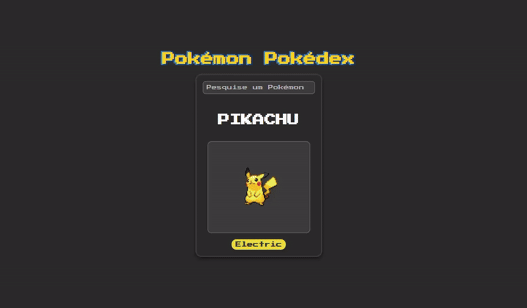

# Pokémon Pokédex 

Este projeto é uma Pokédex que utiliza a [PokeAPI](https://pokeapi.co/) para fornecer informações sobre Pokémon. Os usuários podem pesquisar e visualizar dados como imagem, nome e tipo dos Pokémon.

## 🎥 Demonstração

<div align="center">
  <a href="https://angular-pokedex-roan.vercel.app/" target="_blank">
    
  </a>
</div>

## ⚙️ Funcionalidades

- Pesquisa de Pokémon por nome.
- Exibição da imagem, nome e tipos do Pokémon pesquisado.
- Interface amigável e responsiva.

## 🛠️ Tecnologias Utilizadas 

- 💻 **Frontend:** TypeScript, HTML e CSS
- 🅰️ **Framework:** [Angular](https://angular.io/)
- 🗂️ **API:** [PokeAPI](https://pokeapi.co/)

## 🚀 Como Rodar o Projeto 

1. Clone o repositório:

```bash
git clone https://github.com/joschonarth/angular-pokedex
```

2. Navegue até o diretório do projeto:

```bash
git clone cd angular-pokedex
```

3. Instale as dependências:

```bash
npm install
```

4. Inicie o servidor de desenvolvimento do Angular:

```bash
ng serve
```

5. Abra o navegador e acesse `http://localhost:4200`.

## 🌐 Teste o Projeto 

Experimente a Pokédex diretamente no site: [Pokémon Pokédex](https://angular-pokedex-roan.vercel.app/)

## 🤝 Contribuição 

Contribuições são bem-vindas! Se você encontrar um bug ou tiver uma sugestão de melhoria, por favor, abra um issue ou envie um pull request.

## 📜 Licença 

Este projeto está licenciado sob a [MIT License](LICENSE).

## 📫 Contato 

<div>
    <a href="https://www.linkedin.com/in/joschonarth/" target="_blank"></a>
    <a href="mailto:joschonarth@gmail.com" target="_blank"></a>
</div>
